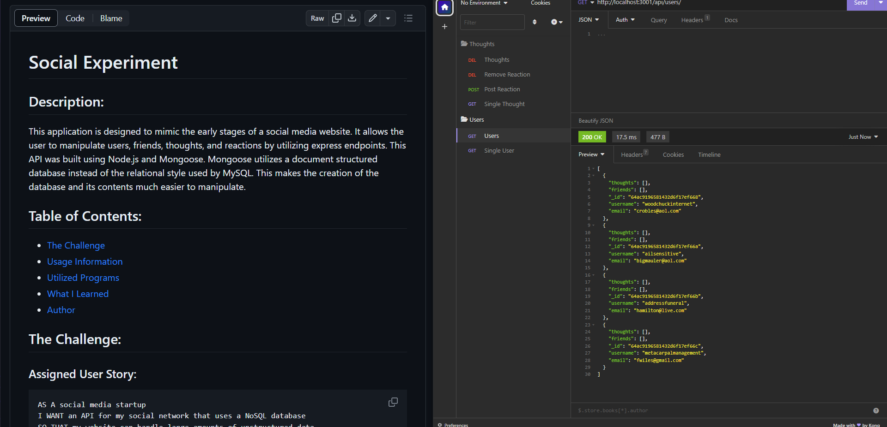

# Social Experiment

## Description:
This application is designed to mimic the early stages of a social media website. It allows the user to manipulate users, friends, thoughts, and reactions by utilizing express endpoints. This API was built using Node.js and Mongoose. Mongoose utilizes a document structured database instead of the relational style used by MySQL. This makes the creation of the database and its contents much easier to manipulate.

## Table of Contents:
- [The Challenge](#The-Challenge)
- [Usage Information](#Usage-Information)
- [Utilized Programs](#Utilized-Programs)
- [What I Learned](#What-I-Learned)
- [Author](#Author)

## The Challenge

### Assigned User Story:
```md
AS A social media startup
I WANT an API for my social network that uses a NoSQL database
SO THAT my website can handle large amounts of unstructured data
```

### Acceptance Criteria:
```md
GIVEN a social network API
WHEN I enter the command to invoke the application
THEN my server is started and the Mongoose models are synced to the MongoDB database
WHEN I open API GET routes in Insomnia for users and thoughts
THEN the data for each of these routes is displayed in a formatted JSON
WHEN I test API POST, PUT, and DELETE routes in Insomnia
THEN I am able to successfully create, update, and delete users and thoughts in my database
WHEN I test API POST and DELETE routes in Insomnia
THEN I am able to successfully create and delete reactions to thoughts and add and remove friends to a user’s friend list
```

### Screenshot:


## Usage Information

### Installation:
1. Navigate to repository linked below
2. Clone the repo to local storage
3. After opening the application, open the terminal and install necessary packages using "npm i"
4. Install Insomnia
5. Start the server using the "npm start" script
6. Test API endpoints in Isomnia at http://localhost:3001

### Endpoints:
GET:
    /api/users - get all users
    /api/user/:userId - get single user by ID
    /api/thoughts - get all thoughts
    /api/thoughts/:thoughtId - get single thought by ID
POST:
    /api/users - create new user
    /api/users/:userId/friends/:friendId - add friend to a user by ID
    /api/thoughts - create a new thought
    /api/thoughts/:thoughtId/reactions - add reaction to a thought
PUT:
    /api/users/:userId - update a user by ID
    /api/thought/:thoughtId - update a thought by ID
DELETE:
    /api/users/:userId - delete a user by ID
    /api/users/:userId/friends/:friendId - delete a friend by ID
    /api/thoughts/:thoughtId - delete thought by ID
    /api/thoughts/:thoughtId/reactions/:reactionId - delete reaction by ID


### Walkthrough Video:

## Utilized Programs

## What I Learned

## Author
Follow me on GitHub at [Jonathan Olsen](https://github.com/jonathanjjolsen)!
